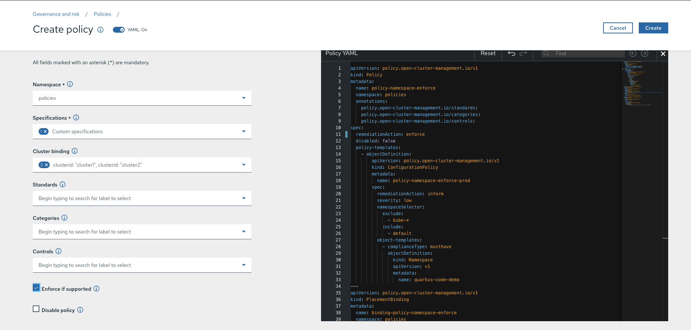

# Quick Demo of Quarkus Cafe Policies on ACM

### Policies
Defines the different "checks" clusters will be validated against. Policies have Specifications. A Specification is a set of rules that will be validated against the clusters.

### Create polices namespace for policy definitions 
```
oc create -f policies/00_namespace.yaml
```

### Namespace must exist on the Target cluster (Enforce)
1. Login into ACM
2. Go to Govern risk


3. Click on Create Policy
4. The Policy creation Wizard will load, configure the following policy  
  a) Name: policy-namespace-enforce  
  b) Namespace: policies  
  c) Specifications: Namespace - must have namespace 'quarkuscoffeeshop-demo'  
  d) Cluster binding: clusterid: "cluster1"  
  e) Standards: Uncheck the selected items  
  f) Categories: Uncheck the selected items  
  g) Controls: Uncheck the selected items  
  h) Enforce if supported: Marked  
  i) Disable policy: Unmarked  
5. Screenshot of Wizard  

6. Ensure the quarkus-cafe-policies exists. By using the oc tool in order to check the status of the policy.
```
$ oc --context hubcluster -n policies get policy -o yaml policy-namespace-enforce
<OUTPUT HIDDEN>
status:
  placement:
  - placementBinding: binding-policy-namespace-enforce
    placementRule: placement-policy-namespace-enforce
  status:
  - clustername: managed-cluster1
    clusternamespace: managed-cluster1
    compliant: Compliant
```

**You may also use the command below to create this policy**
```
oc create -f policies/01_namespace_must_exists_enforce.yaml
```

## Namespace must exist on the target clusters (Inform)
1. Delete the previous policy
```
oc --context hubcluster delete -f policies/01_namespace_must_exists_enforce.yaml
```

2.  create the policy which will ensure a namespace named quarkuscoffeeshop-demo exists on all the AWS clusters 
```
oc --context hubcluster create -f policies/02_namespace_must_exists_inform.yaml
```

3. Check to see the status of the quarkuscoffeeshop-demo namespace

## Deployment must exist on a given namespace and cluster (Inform)
This policy will ensure a deployment named `quarkus-cafe-customermocker` exists in the namespace the quarkuscoffeeshop-demo  for target clusters (labeled as clusterid: cluster1). In case the deployment doesn't exist, the cluster will be marked as non-compliant.
```
oc --context hubcluster create -f policies/03_deployment_must_exists_inform.yaml
```

## Pod must exist on a given namespace and cluster (Enforce)
This policy will ensure a nginx pod exists in the namespace default for development clusters (labeled as environment: dev). In case the pod doesn't exists, it will be created automatically.
```
oc --context hubcluster create  -f policies/04_pod_must_exists_enforce.yaml
```

## Limit Memory Range on a given namespace and cluster
This policy will ensure that Pods have default memory requests and limits in the given Namespace. This policy will target the clusters (labeled as clusterid: cluster1) and the namespace quarkuscoffeeshop-demo.

The Policy will add default memory requests and limits to containers which do not provide resource configuration in the quarkuscoffeeshop-demo namespace.
```
oc --context hubcluster create  -f policies//05_memory_limitrange.yaml
```

Test that the quarkus-cafe-apps have the updated limits
```
oc --context=cluster1 -n quarkuscoffeeshop-demo get pods -l app=quarkus-cafe-barista -o jsonpath='{.items[*].spec.containers[*].resources}'
oc --context=cluster2 -n quarkuscoffeeshop-demo get pods -l app=quarkus-cafe-barista -o jsonpath='{.items[*].spec.containers[*].resources}'
oc --context=cluster3 -n quarkuscoffeeshop-demo get pods -l app=quarkus-cafe-barista -o jsonpath='{.items[*].spec.containers[*].resources}'

oc --context=cluster1 -n quarkuscoffeeshop-demo get pods -l app=quarkus-cafe-customermocker -o jsonpath='{.items[*].spec.containers[*].resources}'
oc --context=cluster2 -n quarkuscoffeeshop-demo get pods -l app=quarkus-cafe-customermocker -o jsonpath='{.items[*].spec.containers[*].resources}'
oc --context=cluster3 -n quarkuscoffeeshop-demo get pods -l app=quarkus-cafe-customermocker -o jsonpath='{.items[*].spec.containers[*].resources}'
```

## Related Links
[Introduction to GitOps and Policies with ACM](https://github.com/open-cluster-management/labs/tree/master/introduction-to-gitops-and-policies)  
[Comply to Standards Using Policy-based Governance of Red Hat Advanced Cluster Management for Kubernetes](https://www.openshift.com/blog/comply-to-standards-using-policy-based-governance-of-red-hat-advanced-cluster-management-for-kubernetes-1)  
[How to Integrate Open Policy Agent with Red Hat Advanced Cluster Management for Kubernetes policy framework](https://www.openshift.com/blog/how-to-integrate-open-policy-agent-with-red-hat-advanced-cluster-management-for-kubernetes-policy-framework)  