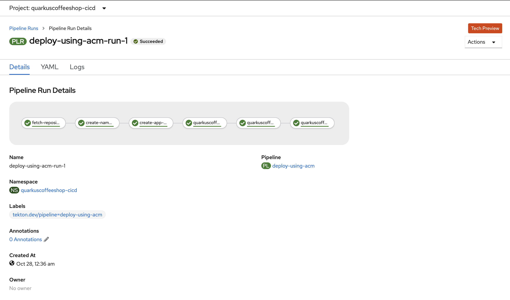

# Quarkus Cafe Deployment  on ACM using tekton pipelines


## Goal

Deploy Quarkus CoffeeShop app using tekton pipelines via ACM.



## Install OpenShift Pipelines 
[Installing the Red Hat OpenShift Pipelines Operator in web console](https://docs.openshift.com/container-platform/4.6/pipelines/installing-pipelines.html)

## Configure Pipelines

**Create Project**
```
oc new-project quarkuscoffeeshop-cicd
```

**Check Service account pipeline exists**
```
oc get serviceaccount pipeline
```

**Give Cluster admin permissions to project**
```
 oc adm policy add-cluster-role-to-user cluster-admin system:serviceaccount:quarkuscoffeeshop-cicd:pipeline
```

**Creates persistent volume required for pipeline**
```
oc create -f tekton/prepare/tekton-source-pvc.yaml 
```

**Tekton Task: to create namespace**
```
oc create -f tekton/01_namespace.yaml
```

**Tekton Task: to Application Subscription**
```
oc create -f tekton/02_create_app_subscription.yaml
```

**Tekton Task to deploy app on dev cluster**
`clusterid=cluster1 in this example`
```
oc create -f tekton/03_create_dev_app_using_acm.yaml
```

**Tekton Task to deploy app on qa cluster**
`clusterid=cluster2 in this example`
```
oc create -f tekton/03_create_qa_app_using_acm.yaml
```

**Tekton Task to deploy app on prod cluster**
`clusterid=cluster3 in this example`
```
oc create -f tekton/03_create_prod_app_using_acm.yaml
```

**Create Deployment pipeline**
```
oc create -f tekton/pipeline-acm.yaml
```

**Start Pipeline Run**
```
oc create -f tekton/pipelinerun.yaml
```


## Addtional links
https://github.com/giofontana/rhacm-pipelines