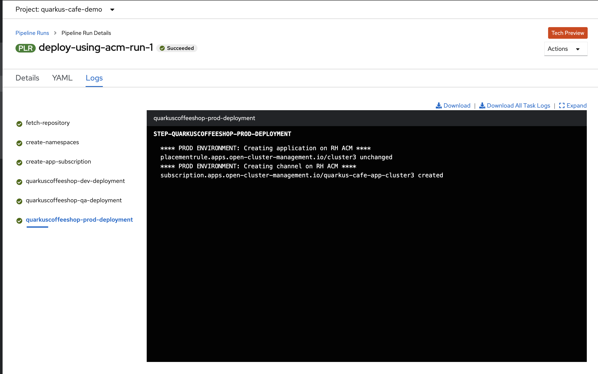

# Quarkus Cafe Deployment  on ACM using tekton pipelines




### Install OpenShift Pipelines 

```
oc new-project quarkuscoffeeshop-cicd
```


```
oc get serviceaccount pipeline
```

```
 oc adm policy add-cluster-role-to-user cluster-admin system:serviceaccount:quarkuscoffeeshop-cicd:pipeline
```

```
oc create -f tekton/prepare/tekton-source-pvc.yaml 
```

```
oc create -f tekton/01_namespace.yaml
```

```
oc create -f tekton/02_create_app_subscription.yaml
```

```
oc create -f tekton/03_create_dev_app_using_acm.yaml
```

```
oc create -f tekton/03_create_qa_app_using_acm.yaml
```

```
oc create -f tekton/03_create_prod_app_using_acm.yaml
```


```
oc create -f tekton/pipeline-acm.yaml
```


```
oc create -f tekton/pipelinerun.yaml
```


Addtional links
https://github.com/giofontana/rhacm-pipelines